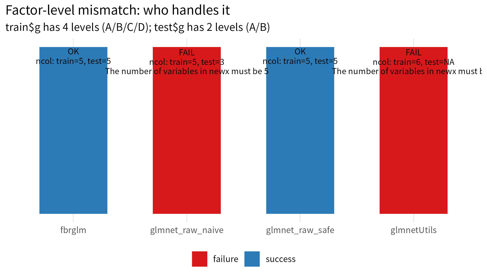
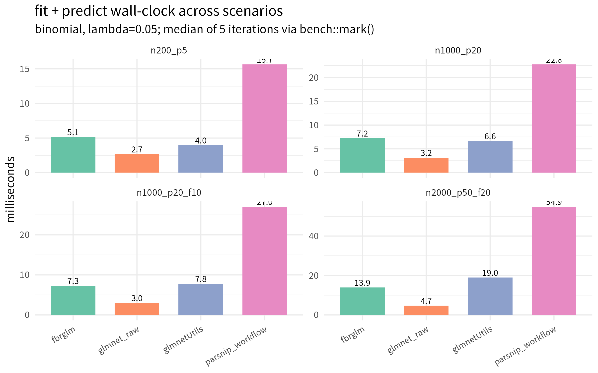

# fbrglm-experiments

Reproducible experiments and benchmarks for
[fbrglm](https://github.com/dsc-chiba-u/fbrglm) — a formula-based
regularized GLM that wraps `glmnet` with a `glm()`-style interface.

The fbrglm package itself lives in a separate repository. This
repository hosts:

- **smoke tests** — minimal correctness checks that verify every fbrglm
  release against `glmnet`.
- **small benchmarks** — first-cut comparisons against `glmnet` and
  `glmnetUtils`, intended to be runnable in seconds and to stay
  pinned in git.
- **conda environment** — `environment.yml` defining the
  `fbrglm-dev` conda env used throughout.

Larger benchmarks (high-dimensional, slow CV, inference variants) will
land here later; the small benchmarks are sized so they can be re-run
on every fbrglm change without friction.

## Setup

```sh
conda env create -f environment.yml          # first time only
conda activate fbrglm-dev
```

`scripts/00_install_local_fbrglm.R` installs the local fbrglm from
`/home/koki/dev/fbrglm`. It prefers `pak`, falls back to `devtools`,
and falls back again to base `install.packages(repos = NULL, type = "source")`
when the others can't satisfy a binary dependency.

## Smoke tests

`scripts/run_all_smoke.R` sources, in order:

| # | script                                           | what it checks |
|---|--------------------------------------------------|----------------|
| 0 | `00_install_local_fbrglm.R`                      | install local fbrglm |
| 1 | `01_smoke_basic.R`                               | gaussian / binomial / poisson basics |
| 2 | `02_against_glmnet_fixed_lambda.R`               | `lambda = "fix"` matches direct `glmnet` (max abs diff < 1e-6) |
| 3 | `03_predict_factor_newdata.R`                    | `predict()` survives missing factor levels in newdata |
| 4 | `04_missing_report.R`                            | `nobs_info$n_total / n_dropped_missing / n_used` are right |
| 5 | `05_lambda_cv_equivalence.R`                     | `lambda = "cv_min" / "cv_1se"` match `cv.glmnet` with fixed `foldid` |

```sh
Rscript scripts/run_all_smoke.R
```

## Small benchmarks

`scripts/run_all_benchmarks_small.R` runs:

- `scripts/10_benchmark_prediction_failures.R` — predict path resilience
  to a train/test factor-level mismatch.
- `scripts/11_benchmark_runtime_small.R` — wall-clock for fit+predict on
  a small binomial dataset.
- `scripts/12_benchmark_families_small.R` — parity sweep across every
  glmnet-compatible family. For each `(family, method)` cell, records
  fit / predict success, runtime, and the maximum absolute difference
  vs raw `glmnet`. Negative binomial here means **fixed θ** via
  `MASS::negative.binomial(theta = ...)`; Cox here means **native
  glmnet Cox** (a `Surv()` LHS with `family = "cox"`), not the
  piecewise exponential Poisson formulation that the fbrglm vignette
  walks through. Methods that do not have a same-engine `glmnet`
  equivalent for a family (e.g. the tidymodels stack has no built-in
  Gamma + glmnet engine in this setup) are recorded with
  `supported_attempted = FALSE` and the reason in `note`.

```sh
Rscript scripts/run_all_benchmarks_small.R
Rscript scripts/20_plot_small_benchmarks.R
```

Outputs land under:

- `results/summary/prediction_failures_small.csv`
- `results/summary/runtime_small.csv`
- `results/summary/families_small.csv` and
  `results/raw/families_small_raw.csv`
- `results/figures/prediction_failures_small.png`
- `results/figures/runtime_small.png`

### Prediction-failure benchmark

Train has factor `g` with levels `A/B/C/D`; test has `g` with **levels
narrowed to `A/B`** (the factor object itself has only two levels, not
just two observed values). This is the canonical setup where a naive
`glmnet` caller gets bitten.

| method               | success | train_ncol | test_ncol | note |
|----------------------|---------|-----------:|----------:|------|
| `fbrglm`             | ✅      | 5          | 5         | auto: `xlevels` stored on the fit object |
| `glmnet_raw_naive`   | ❌      | 5          | 3         | manual: `model.matrix(train)` vs `model.matrix(test)` built separately |
| `glmnet_raw_safe`    | ✅      | 5          | 5         | manual: `relevel(test$g, levels = levels(train$g))` before `model.matrix` |
| `glmnetUtils`        | ❌      | 6          | NA        | formula interface, but failed under narrowed test factor levels |
| `parsnip_workflow`   | ✅      | NA         | NA        | tidymodels workflow with the `glmnet` engine; hardhat/recipes restore xlevels |

Failure rows produce a `glmnet` runtime error of the form
`The number of variables in newx must be N`.



The takeaway: fbrglm's `predict()` and parsnip's workflow path both
handle narrowed test factors automatically because each stores the
training-time xlevels on the fit. `glmnet_raw_safe` works as well, but
moves the bookkeeping to the caller. `glmnet_raw_naive` and
`glmnetUtils` fail — the friction fbrglm is meant to remove.

### Runtime benchmark

Binomial fit + predict at a fixed λ = 0.05, across four scenarios.
Median of 5 iterations from `bench::mark()`, all units in milliseconds.

| scenario        | n    | p_num | n_factor × n_levels | fbrglm | glmnet_raw | glmnetUtils | parsnip_workflow |
|-----------------|-----:|------:|--------------------:|-------:|-----------:|------------:|-----------------:|
| `n200_p5`       |  200 |     5 |                  — |    4.9 |        2.7 |         4.0 |             15.8 |
| `n1000_p20`     | 1000 |    20 |                  — |    7.2 |        3.0 |         6.6 |             22.2 |
| `n1000_p20_f10` | 1000 |    20 |          1 × 10    |    7.5 |        3.2 |         7.8 |             26.6 |
| `n2000_p50_f20` | 2000 |    50 |          1 × 20    |   14.4 |        4.8 |        15.9 |             55.4 |

Pattern in this small grid:

- raw `glmnet` is the fastest because it does no formula / factor
  bookkeeping at all.
- `fbrglm` sits roughly 2–3× the raw `glmnet` cost and is broadly
  comparable to `glmnetUtils` across these scenarios (slightly faster
  on the larger factor case).
- The `parsnip` / `workflows` path is consistently the heaviest in this
  tested setting (≈ 3–4× fbrglm), since each call rebuilds the
  hardhat / workflows preprocessing stack.

These numbers are intentionally tiny — a larger, more rigorous suite
will follow.



Numbers are illustrative — the dataset is intentionally tiny, and a
larger benchmark suite will follow.

## Manuscript-ready summaries

`scripts/30_make_manuscript_tables.R` turns the small-benchmark CSVs
into compact summary tables aimed at paper drafts and the README:

- `results/summary/manuscript_prediction_table.csv` /
  `results/summary/manuscript_prediction_table.md` — one row per method
  with success / user-burden / one-line interpretation
- `results/summary/manuscript_runtime_table.csv` /
  `results/summary/manuscript_runtime_table.md` — one row per
  `(scenario, method)` with median runtime in ms, ratio to raw `glmnet`,
  and a one-word interpretation
- `results/summary/manuscript_family_table.csv` /
  `results/summary/manuscript_family_table.md` — family-wide parity
  summary for paper drafts: one row per glmnet-compatible family with
  fbrglm vs raw `glmnet` diff, fit + predict runtime, and a short note

The Markdown variants are pipe tables that paste into GitHub READMEs
and Pandoc-flavoured Markdown directly.

```sh
Rscript scripts/30_make_manuscript_tables.R
```

## Layout

```
R/                          # shared helpers
  data_generators.R         #   data factories
  benchmark_helpers.R       #   safe_run(), save_result_csv()
scripts/
  00_install_local_fbrglm.R
  01_smoke_basic.R
  02_against_glmnet_fixed_lambda.R
  03_predict_factor_newdata.R
  04_missing_report.R
  05_lambda_cv_equivalence.R
  10_benchmark_prediction_failures.R
  11_benchmark_runtime_small.R
  12_benchmark_families_small.R
  20_plot_small_benchmarks.R
  30_make_manuscript_tables.R
  run_all_smoke.R
  run_all_benchmarks_small.R
results/
  summary/                  # canonical summary CSVs and MD tables
  figures/                  # generated PNGs
  raw/                      # per-iteration / per-row raw benchmark artifacts
environment.yml             # conda env spec for fbrglm-dev
```
